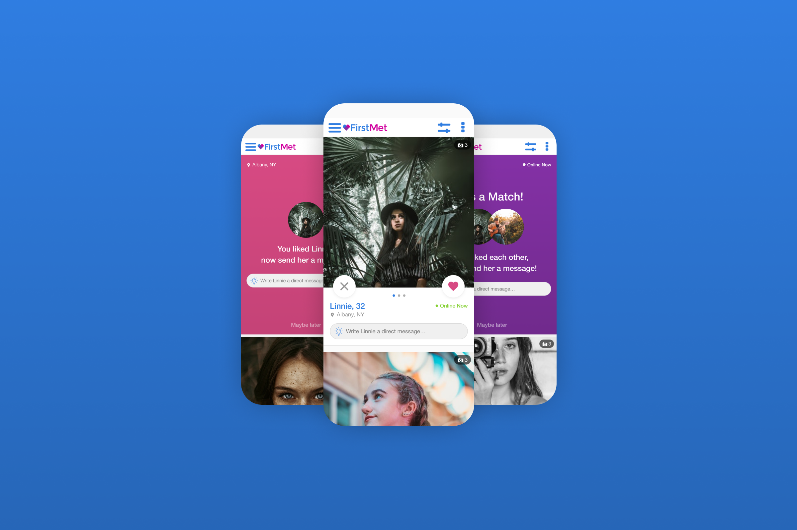

import Section from '../../../components/section'
import SectionRow from '../../../components/section-row'
import SectionContent from '../../../components/section-content'

<Section
sticky
title="So what's the problem?"
stepNumber="01"
stepName="Discover"
>
<SectionRow fullHeight>
<SectionContent rightCol>

#### Problem 1: Dated

Although we were always A/B testing new features, the core experience and interface of FirstMet had not changed in over 10 years. User’s found it dated compared to competitors.

</SectionContent>
</SectionRow>
<SectionRow fullHeight>
<SectionContent rightCol>

#### Problem 2: Staying Competitive

FirstMet was having trouble retaining users. The dating space was now super saturated with competitors whose interfaces were more modern and simple.

</SectionContent>
</SectionRow>
<SectionRow fullHeight>
<SectionContent rightCol>

#### Problem 3: Where is it?

10 years of feature testing had created some bloat and odd user Journeys. User’s found the experience hard to navigate at times.

</SectionContent>
</SectionRow>
</Section>

<Section
sticky
title="Do your homework"
stepNumber="01"
stepName="Discover"
>
<SectionRow>
<SectionContent rightCol>

#### Stakeholder Interviews

First I met with the Product Manager and executive stakeholders to determine project scope, manage expectations, and determine success metrics.

#### Data Analysis

With the help of the Business Insights team, we gathered and analyzed current engagement data to set baselines and find areas for improvement.

#### Competitive Analysis &amp; UX Inspiration

The team regularly audited and examined other companies' sign up flows and marketing efforts for inspiration, to understand their strengths and weaknesses, and to figure out how we could stand out in a crowded marketplace.

#### Usability Testing &amp; Surveys

We conducted usability testing to gain insights and feedback on the current experience and find friction points. Users were asked to complete the sign-up process and then perform certain tasks such as liking another user and sending a message. Their experience was screen-recorded, and they were asked to complete a set of questions immediately afterwards. This feedback was evaluated and turned into actionable items. We also met with the customer service team, who provided common customer complaints about their experience with the app.

</SectionContent>
</SectionRow>
</Section>

<Section
sticky
title="The best laid plans"
stepNumber="01"
stepName="Discover"
>
<SectionRow>
<SectionContent>

</SectionContent>
</SectionRow>
<SectionRow>
<SectionContent rightCol>

#### User Journey mapping

Everything about the current experience had been finely tuned and optimized over 10 years of constant A/B testing and iteration. It was important we mapped and understood the current flows. We needed to maintain or improve certain engagement triggers, especially for premium users, to avoid hurting engagement metrics.

#### Wireframing

I began exploring solutions for different parts of the user experience including the main browse section, user profiles, and messaging. I then met with the Product Manager to review and refine the proposed concepts.

#### Development and Analytics Requirements

After refining the planned user experience, we met with the dev team to determine feasibility and scope, start planning development, and audit what analytics data we would need to collect for later analysis.

</SectionContent>
</SectionRow>
</Section>

